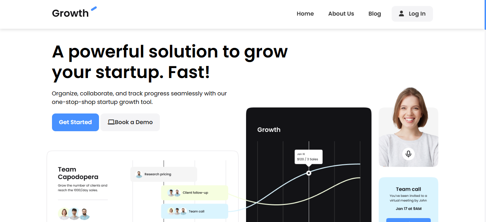

# SaaS Startup Growth Solution



This is a demo of a SaaS platform designed to help startups grow faster by organizing, collaborating, and tracking progress in one easy-to-use tool. The website showcases features like task management, contact tracking, and real-time reporting for businesses. It is built with HTML, CSS, and JavaScript, providing an engaging and user-friendly experience for users looking to scale their business efficiently.

## Features
- **Responsive Design**: The site is fully responsive, adapting seamlessly to various screen sizes including desktops, tablets, and smartphones.
- **Hero Section**: Displays key information about the startup growth platform and its main benefits.
- **Interactive Buttons**: "Get Started" and "Book a Demo" buttons for users to engage with the platform.
- **Testimonial Section**: Showcases success stories from businesses that have used the platform to improve productivity.
- **Pricing Plans**: Offers a clear view of pricing for both free and premium options with features explained in detail.
- **FAQ Section**: Frequently asked questions to assist users in understanding the product and how to get started.
- **Footer**: Provides navigation links to key sections like "About Us," "Resources," and "Contact."

## Technologies Used
- **HTML**: Provides the basic structure and content of the webpage.
- **CSS**: Styles the layout, design, and responsiveness of the website.
- **JavaScript**: Adds interactivity, such as smooth scrolling and dynamic behavior for elements like the hamburger menu.
- **Font Awesome**: For icons, including buttons and social media links.
- **Google Fonts**: Provides clean and modern typography (Poppins font family).

## Getting Started

### Prerequisites
Before running the project locally, ensure you have a web browser installed (e.g., Chrome, Firefox, Safari).

### Installation
1. Clone the repository to your local machine:
    ```bash
    git clone https://github.com/abhisekumarjha/saas-clone.git
    ```
2. Navigate to the project directory:
    ```bash
    cd saas-clone
    ```
3. Open the `index.html` file in your web browser to view the project:
    ```bash
    open index.html
    ```

### Live Demo
You can also view the live demo of the project hosted on Vercel [here](https://saas-clone-jha.vercel.app/).
